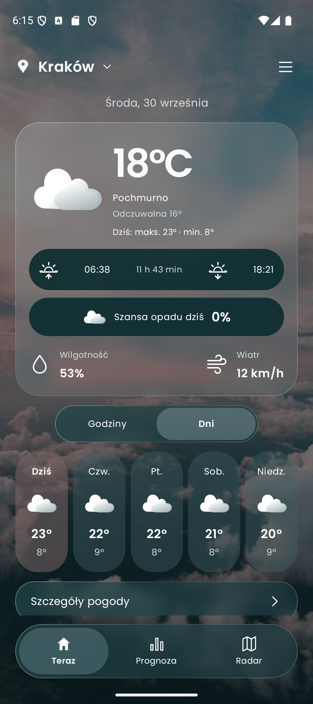

# Cirral

**Cirral** to aplikacja pogodowa na Androida. Pokazuje bieżące warunki, prognozę godzinową i dziesięciodniową oraz mapę ostatnich opadów. Działa bez konta, własnego serwera i klucza API.



## Co potrafi

- **Pogoda teraz:** temperatura, odczuwalna temperatura, opady, wiatr, wilgotność, indeks UV oraz wschód i zachód słońca.
- **Prognoza:** interaktywne wykresy na 24 godziny i widok 10 dni z temperaturą, opadami oraz porywami wiatru.
- **Radar opadów:** mapa z animacją historycznych klatek, wyborem czasu i wyśrodkowaniem na wybranej miejscowości.
- **Miejsca:** wyszukiwanie miast na świecie, lokalizacja telefonu i szybki powrót do ostatnio wybranych miejsc.
- **Ustawienia:** jednostki °C/°F i km/h/mph, pięć teł nieba oraz automatyczna zmiana tła zgodnie z porą dnia.
- **Dostęp bez sieci:** ostatnia pobrana prognoza pozostaje widoczna wraz z czasem aktualizacji. Radar wymaga połączenia z internetem.

## Pobranie na telefon

Otwórz najnowsze [wydanie aplikacji](../../releases/latest) na telefonie i pobierz plik `Cirral-*.apk` z sekcji **Assets**. Następnie otwórz pobrany plik i zezwól Androidowi na instalację z używanej przeglądarki, jeśli system o to poprosi. Wymagany jest Android 8.0 lub nowszy.

Wydania udostępniane bezpośrednio tutaj służą do instalacji poza Google Play. Źródłem pliku powinno być to repozytorium.

## Zbudowanie ze źródeł

Otwórz główny folder projektu w Android Studio z JDK 17 lub nowszym i Android SDK 35. Projekt korzysta z Gradle Wrapper, więc nie wymaga osobnej instalacji Gradle. Aby zbudować wersję debugową z terminala:

```bash
./gradlew :app:assembleDebug
```

Na Windows użyj `gradlew.bat :app:assembleDebug`. APK pojawi się w `app/build/outputs/apk/debug/`.

## Źródła danych i prywatność

Prognoza i wyszukiwanie miejsc korzystają z [Open-Meteo](https://open-meteo.com/), radar z [RainViewer](https://www.rainviewer.com/api/weather-maps-api.html), a mapa z [OpenFreeMap](https://openfreemap.org/) i MapLibre. Przy użyciu lokalizacji telefonu współrzędne są wysyłane do usługi pogodowej w celu pobrania prognozy. Ostatnie miejsca, ustawienia i prognoza są zapisywane lokalnie. Aplikacja nie ma własnego serwera ani kont użytkowników.

Radar pokazuje klatki **historyczne**, nie prognozę przyszłych opadów. Dostępność i szczegółowość danych zależą od zewnętrznych usług.

## Zasoby graficzne

Czcionka Poppins jest udostępniana na [licencji SIL Open Font License](design/Poppins-OFL.txt). Zdjęcie ekranu startowego: Leandro De Torres / [Unsplash](https://unsplash.com/photos/soft-clouds-in-a-pastel-sky-at-dusk-XWQa3P5c8WQ) ([licencja](https://unsplash.com/license)). Pozostałe tła nieba przygotowano dla projektu.
